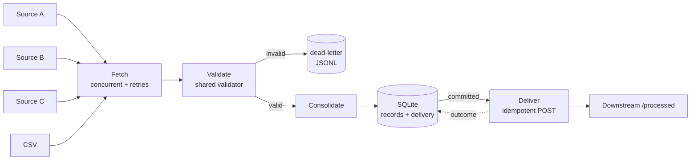

# Resilient Multi-Source Data Integration & Processing Service

Collects records from **three REST sources + a CSV file**, validates them through **one shared pipeline**, consolidates them to **one deterministic record per `id`**, persists them **idempotently** to SQLite, then notifies a **downstream API** with retry-safe, idempotent delivery - while treating every external system as unreliable.

> **205 tests · 99 % line coverage · runs fully offline · no real external services**
> Quick demo: `python -m src.main` (all failure modes at once) · Quick tests: `pytest -m "not slow"`

---

## Contents
1. [Solution overview](#1-solution-overview)
2. [Architecture](#2-architecture)
3. [Setup & execution](#3-setup--execution)
4. [Data rules](#4-data-rules-how-bad-and-conflicting-data-is-handled)
5. [Mock data & external systems](#5-mock-data--external-systems)
6. [Persistence](#6-persistence) (+ PostgreSQL adaptation)
7. [Downstream integration & the timeout problem](#7-downstream-integration--the-timeout-problem)
8. [Concurrency](#8-concurrency)
9. [Failure scenarios](#9-failure-scenarios)
10. [Scaling to 10-20 million records per source](#10-scaling-to-1020-million-records-per-source)
11. [Technical decisions](#11-technical-decisions)
12. [Testing & mocking strategy](#12-testing--mocking-strategy)
13. [Assumptions & limitations](#13-assumptions--limitations)
14. [Project layout](#14-project-layout) · [Reflection](REFLECTION.md)

---

## 1. Solution overview

**What it does.** One run: fetch → validate → consolidate → persist → notify.

1. **Fetch** sources A, B, C (paginated REST) *concurrently* with the CSV file. Each source has retries, timeouts, a pagination-loop guard and a wall-clock deadline. A source that fails keeps whatever it already returned and **never affects the others**.
2. **Validate** every record - API or CSV - with the *same* function (`models.validate_record`). It never raises; bad records become `InvalidRecord`s with machine-readable reasons and are written to a dead-letter file.
3. **Consolidate** to one winner per `id`: latest valid `updated_at`; ties by source priority **A > B > C > FILE**; any remaining tie by content, so the result never depends on arrival order.
4. **Persist** in SQLite with an upsert that only overwrites a row when the incoming record is strictly better by the same ordering. Re-running is a no-op; a stale or partial run can't regress data.
5. **Notify** the downstream `POST /processed` for every record *version* not yet confirmed there, with a deterministic `Idempotency-Key`, bounded retries and persisted delivery state.

**Exit codes:** `0` clean · `2` degraded (a source failed, or downstream deliveries unconfirmed/rejected - healthy data was still processed) · `1` fatal (database failure).

**Major components**

| Module | Responsibility |
|---|---|
| `src/models.py` | `RawRecord` / `ValidRecord` / `InvalidRecord`, **`validate_record`** (the single validator), idempotency-key + timestamp helpers |
| `src/fetchers/api_fetcher.py` | Paginated, retried, concurrent REST fetching; async-generator page iterator |
| `src/fetchers/csv_fetcher.py` | Forgiving CSV reader → same `RawRecord` shape as the API fetcher |
| `src/processing/consolidator.py` | `validate_all` (fan-out) and `consolidate` (pure, deterministic) |
| `src/db/database.py` | SQLite: schema, transactional batched upsert, delivery-state table, `DatabaseError` |
| `src/downstream/client.py` | Idempotent, retrying `POST /processed` with bounded concurrency |
| `src/retry.py`, `src/config.py` | Retry/backoff policy (injectable `sleep`), env-driven settings |
| `src/pipeline.py`, `src/main.py` | Orchestration + run report; CLI |
| `src/mock_servers/` | The mocked world: sources A/B/C + downstream, scenarios, in-process transport, live server |

## 2. Architecture

```
 Mock API A ──┐                                         ┌── dead-letter file (rejected_records.jsonl)
 Mock API B ──┼─► FETCH (asyncio, concurrent,           │
 Mock API C ──┤     retries, deadline, loop guard)      │
 CSV file  ───┘            │                            │
                           ▼                            │
                  VALIDATE  (one shared validator) ─────┘
                           │ valid records
                           ▼
                  CONSOLIDATE (latest updated_at ▸ A>B>C>FILE ▸ content)
                           │ one winner per id
                           ▼
                  PERSIST ── SQLite ── records (PK id)  +  delivery (PK idempotency_key)
                           │ commit succeeded
                           ▼
                  DELIVER: versions not yet confirmed ──► POST /processed  (Idempotency-Key, retries)
                           │
                           ▼
                  record outcome in `delivery`  ─►  confirmed | unconfirmed (retry next run) | rejected
```



## 3. Setup & execution

**Python:** 3.11 or newer (developed on 3.12; uses `asyncio.timeout` / `asyncio.Barrier`).
**Dependencies:** `httpx`, `fastapi`, `uvicorn` (runtime/mocks) + `pytest`, `pytest-asyncio`, `pytest-cov` - see `requirements.txt`.

```bash
python -m venv .venv
source .venv/bin/activate            # Windows: .venv\Scripts\activate
pip install -r requirements.txt
```

**Database initialisation:** automatic (`CREATE TABLE IF NOT EXISTS` on every run) - nothing to do. The file is `data/records.db`.

### Run the application

```bash
python -m src.main                      # default 'demo' scenario: B dies after page 1, C always 429, downstream accepts-then-times-out
python -m src.main --scenario happy     # everything healthy
python -m src.main --scenario happy     # run it AGAIN: inserted=0, nothing re-sent downstream
python -m src.main --scenario source-a-down
python -m src.main --bulk 10000         # 10,000 unique ids (~22k source rows incl. duplicates/invalid), ~7 s
python -m src.main --help               # all options: --scenario --csv --db --bulk --reset-db --json --base-url -v
```

Scenarios: `happy`, `demo`, `source-a-down` (TCP connection failure), `source-a-503`, `slow-source`, `flaky`, `downstream-timeout`, `downstream-down`, `downstream-reject`, `pagination-loop` (`src/mock_servers/scenarios.py`).

By default the mock world runs **in-process** - no ports, identical on every OS. Config knobs are `DIS_*` environment variables (`DIS_DB_PATH`, `DIS_CSV_PATH`, `DIS_REQUEST_TIMEOUT`, `DIS_MAX_ATTEMPTS`, `DIS_BASE_BACKOFF`, `DIS_DB_BATCH_SIZE`, `DIS_MAX_CONCURRENCY`, `DIS_REJECTED_PATH`).

### Run the mocks as a real HTTP server (optional)

```bash
# terminal 1
python -m src.mock_servers.server --scenario demo --port 8000
# terminal 2
curl "http://127.0.0.1:8000/source/a?page=1"
curl "http://127.0.0.1:8000/_debug/stats"
python -m src.main --base-url http://127.0.0.1:8000 --reset-db
```
Same pipeline code, real sockets, real timeouts. (With the server stopped you get real `ConnectError`s - the CSV data is still processed.)

### Run the tests

```bash
pytest                                  # all 205 tests (~12 s; ~30 s with coverage)
pytest -m "not slow"                    # skip the 10,000-record test (~5 s)
pytest --cov --cov-report=term-missing  # coverage
```
Saved results: [`docs/test-results.txt`](docs/test-results.txt), [`docs/coverage.txt`](docs/coverage.txt). A `Makefile` wraps these (`make test`, `make run`, `make cov`).

## 4. Data rules (how bad and conflicting data is handled)

Implemented in `models.validate_record` + `processing/consolidator.py`; each row is covered by tests.

| Situation | Behaviour |
|---|---|
| **Missing / blank ID** | Invalid (`missing_id`). Isolated and dead-lettered; never guessed. Whitespace is stripped (`" rec-010 "` → `rec-010`); integer ids are coerced to strings (`12` → `"12"`); bool/float/list ids are `invalid_id`. IDs are case-sensitive. |
| **Missing fields** (`name`, `status`, `updated_at`) | Absent, `null`, empty or whitespace-only → invalid (`missing_<field>`). Wrong type → `invalid_<field>`. **All** problems of a record are reported together. |
| **Invalid timestamps** | Only ISO-8601 strings accepted. Rejected: garbage, impossible dates (`2026-02-30`), numbers/epochs, sentinels before 1970 (`0001-01-01`), and anything more than 1 day in the future (a far-future record would otherwise "win" forever). Offsets are normalised to UTC; **naive timestamps are assumed UTC**. |
| **Duplicate records** | Not an error. Exact duplicates (same source or across sources) collapse to one. |
| **Conflicting records** (same id, different data) | Latest valid `updated_at` wins - *even over a higher-priority source*. Equal `updated_at` → source priority **A > B > C > FILE**. Equal timestamp *and* source but different content → deterministic content tie-break. Result is independent of input order (tested over all permutations). |
| **Invalid copy vs valid copy** | An invalid copy never hides a valid one: if A's copy of `rec-003` has no name but C's is fine, C's is used. |
| **Unexpected fields** | Ignored (forward-compatible). |
| **Unexpected values** (e.g. `status="unknown-status"`) | Accepted - the brief defines no closed status set. Non-string/unencodable text (e.g. lone surrogates) is invalid. |
| **Non-object records** (`null`, `"string"`, `42` inside `records`) | Invalid (`payload_not_an_object`); the rest of the page is processed normally. |
| **Rejected data** | Written to `data/rejected_records.jsonl` (source, location e.g. `page 2#4` / `line 7`, reasons, payload) and counted by reason in the run report. |

## 5. Mock data & external systems

All external systems are mocked by **one FastAPI app** (`src/mock_servers/world.py`):

```
GET  /source/{a|b|c}?page=N   -> {"records":[{id,name,status,updated_at,...}], "next_page": N+1 | null}
POST /processed               (header Idempotency-Key required)
GET  /_debug/stats            request counts and side-effect counts
```

**Curated data** (`data.py` + `data/sample_input.csv`) covers every required edge case: multiple pages; the same id in several sources; duplicates inside one source; different versions of one record; missing fields; invalid/future timestamps; non-UTC offsets; unexpected fields; `null` / string records mid-page; an empty trailing page; CSV with valid, duplicate, invalid, blank, short, over-long, quoted-comma, Unicode and missing-id rows. Together they consolidate to exactly **15 records** (asserted record-by-record in `tests/test_pipeline.py`).

**Failure modes** (per source, selected via scenario): `down` (503), `always_429` (+`Retry-After`), `fail_after_page_1` (5xx), `flaky` (fails *n* times then recovers), `slow`, `malformed_json`, `bad_shape`, `pagination_loop`, `empty`; plus **connection failure** (`unreachable_sources`). Downstream: `ok`, `timeout_once`, `always_timeout`, `flaky_503`, `reject_400`, `down`.

`InProcessTransport` wraps httpx's ASGI transport because the stock one **ignores timeouts** and can't drop connections - without it, in-process mocks would silently skip the most important failure paths.

## 6. Persistence

```sql
records  (id PK, name, status, updated_at, source, source_priority, version_key, first_seen_at, last_synced_at)
delivery (idempotency_key PK, record_id FK→records, state IN (confirmed|unconfirmed|rejected), attempts, last_error, updated_at)
```

* **Inserts/updates & duplicate prevention:** `INSERT … ON CONFLICT(id) DO UPDATE … WHERE (excluded.updated_at, excluded.source_priority, excluded.name, excluded.status) > (records.updated_at, …)`. The primary key prevents duplicates; the `WHERE` makes the row only ever move "forward" using the *same ordering as the consolidator* - so the database enforces the consolidation rule itself (a test proves "consolidate-then-upsert" ≡ "upsert shuffled raw records").
* **Safe reprocessing:** identical input → `inserted=0 updated=0 unchanged=N`, rows byte-identical (untouched rows aren't even rewritten), and no downstream traffic.
* **Transactions:** one `BEGIN IMMEDIATE … COMMIT` per batch (default 500 rows); any error → `ROLLBACK` of that batch. Earlier committed batches stay valid because every write is idempotent, so "restart and run again" is the recovery procedure.
* **Resources:** short-lived connections, always closed; WAL mode; busy timeout; every `sqlite3.Error` is wrapped as `DatabaseError` so callers handle one type.
* **Timestamps** are stored as fixed-width UTC strings (`2026-01-10T10:00:00.000000Z`) so SQL ordering is chronological even if inputs used different offsets (tested: `11:00+05:30` correctly loses to `10:00Z`).

### Adapting to PostgreSQL in production

* **Same upsert, mostly a driver swap.** PostgreSQL supports `INSERT … ON CONFLICT DO UPDATE … WHERE` and row-value comparison unchanged. Use `TIMESTAMPTZ` for `updated_at`, and `COLLATE "C"` on the `name`/`status` comparison so the tie-break is locale-independent and deterministic.
* **Connection pooling:** `psycopg_pool` / `asyncpg` pool (or PgBouncer) sized to worker count instead of connect-per-operation; `statement_timeout` and `lock_timeout` set; retry only on connection errors, deadlocks (`40P01`) and serialization failures (`40001`).
* **Bulk path:** `COPY` batches into an unlogged staging table, then one set-based `INSERT … SELECT … ON CONFLICT` (10-100× faster than row-at-a-time). Inserted-vs-updated is available via `RETURNING (xmax = 0)`.
* **Concurrent writers:** `READ COMMITTED` is sufficient because the `WHERE` guard is evaluated against the locked, latest row; sort batches by `id` to avoid deadlocks between workers.
* **Delivery as an outbox:** workers claim rows with `SELECT … FOR UPDATE SKIP LOCKED`, so several delivery workers can run without double-sending; unconfirmed rows get `next_attempt_at` with backoff.
* **Operations:** schema managed by migrations (Alembic) rather than `CREATE IF NOT EXISTS`; partitioning/retention for `delivery`; least-privilege DB role; credentials from a secret store.

## 7. Downstream integration & the timeout problem

**Problem:** `POST /processed` times out - the downstream may or may not have processed it. *Don't retry* can lose the update; *blind retry* can double-process.

**Solution (`downstream/client.py`):**

| Concern | Approach |
|---|---|
| **Idempotency** | `Idempotency-Key = sha256(id, updated_at, name, status)[:32]` - identical for every retry of the same *version* (this run, or after a crash/restart), different for a new version. The receiver de-duplicates on it. |
| **Retries** | Only transient failures: timeouts, connection errors, `408`/`429`/`5xx`. Exponential backoff (0.2 s → 0.4 s …, capped), `Retry-After` honoured but capped, **max 3 attempts**. |
| **Permanent failures** | Any other `4xx` → `rejected`, **not** retried. Stored; not re-sent every run (a *new version* of the record gets a new key and is sent). |
| **Retries exhausted** | Outcome is **`unconfirmed`** - we do not claim failure *or* success. It is persisted in `delivery` and automatically re-sent next run with the **same key**, which is safe. The run continues for other records and exits `2`. |
| **Crash safety** | Delivery runs only *after* the DB commit and only for versions without a confirmed/rejected row. Crash before sending → next run sends. Crash after sending but before recording → next run re-sends with the same key; downstream absorbs it. |
| **Backpressure** | Bounded concurrency (`downstream_concurrency`, default 10). |

The mock downstream proves it: in `timeout_once` it *applies* the effect and then answers too slowly. Result: every record is requested twice (timeout + retry) yet produces exactly **one** side effect (`tests/test_pipeline.py::test_downstream_times_out_after_accepting_and_nothing_is_duplicated`, and verified over real sockets: 22 requests → 11 effects).

**"Selected records":** every record *version* not yet confirmed downstream (new, changed, or previously unconfirmed). Unchanged, already-confirmed records are never re-sent. A business-specific filter (e.g. `status == "active"`) would be a one-line predicate in `Database.pending_deliveries`.

## 8. Concurrency

**Chosen: `asyncio` + `httpx.AsyncClient`.** The workload is I/O-bound (waiting on HTTP). asyncio runs all sources - and later thousands of requests - on one thread with tiny per-task cost, deadlines and cancellation are first-class (`asyncio.timeout`), and a shared `Semaphore` gives global backpressure. Threads would work (via `ThreadPoolExecutor`) but cost more per concurrent request, need locks for shared state, and make timeouts/cancellation awkward. Blocking work is kept off the loop (`asyncio.to_thread` for the CSV; SQLite calls are short and batched).

* Sources run concurrently under `asyncio.gather`; each `fetch_source` catches its own failures, so no exception can cross sources (a second safety net uses `return_exceptions=True`).
* **Limits:** global in-flight cap (`max_concurrent_requests`); the cap is held only while a request is in flight, **not while backing off** - a rate-limited source never blocks the others.
* **Proof, not timing:** `test_sources_are_fetched_concurrently_not_sequentially` puts all three source handlers behind an `asyncio.Barrier(3)` - a sequential implementation deadlocks and fails; no flaky sleeps.

## 9. Failure scenarios

| Scenario | Behaviour | Proven by |
|---|---|---|
| **Source A completely unavailable** (conn. failure or 503) | Retries (3), then A is `failed` with an error note; B, C, CSV are validated, persisted and delivered. Exit `2`. | `test_source_a_completely_unavailable` |
| **Source B fails after several pages** | Pages already received are kept and used; pagination for B stops with a recorded error. Exit `2`. | `test_source_b_fails_after_returning_a_page`, `test_5xx_on_later_page_keeps_earlier_pages` |
| **Source C always 429** | Backoff honouring (capped) `Retry-After`, 3 attempts, then `failed`. Bounded - never loops. | `test_source_c_continuously_429` |
| **Database unavailable** | `DatabaseError` → run exits `1`; **nothing is sent downstream** (no delivery without persistence). A batch that fails mid-write rolls back; earlier batches are valid; re-running completes. | `test_database_unavailable_is_fatal…`, `test_database_failure_mid_write_rolls_back_then_rerun_recovers`, `test_failed_batch_is_rolled_back_atomically`, `test_database_locked_…` |
| **Downstream times out after maybe accepting** | Same idempotency key on retry → exactly one effect. If retries run out: `unconfirmed`, retried next run. | `test_downstream_times_out_after_accepting…`, `test_downstream_down_leaves_records_unconfirmed…` |
| **Malformed record mid-data** | That record is dead-lettered with a reason; neighbours unaffected. | `test_non_object_records…`, `test_invalid_records_are_isolated…` |
| **Conflicting versions across sources** | Deterministic rule (latest ▸ A>B>C>FILE ▸ content). | `test_result_is_independent_of_input_order`, e2e table assertion |
| **Crash halfway** | Writes are transactional + idempotent; delivery state is persisted. Recovery = run again. Both crash points (after persist, after send) are tested. | `test_crash_after_persist_before_delivery…`, `test_crash_after_delivery_before_state_recorded…` |
| **Same input again after restart** | `inserted=0 updated=0 unchanged=N`, zero downstream calls. | `test_rerunning_the_same_input_changes_nothing` |
| **Pagination loop** (`page 1 → 2`, `page 2 → 2`) | Seen-pages set stops at the repeat (page 2 is requested exactly once); plus a `max_pages` ceiling and a per-source wall-clock deadline. | `test_pagination_loop_terminates`, `test_pagination_loop_does_not_run_forever` |
| **Source returns stale data after a newer run** | Upsert never lets an older/partial result overwrite newer stored data. | `test_a_stale_partial_run_cannot_regress_stored_data` |

## 10. Scaling to 10-20 million records per source

Today: ~10 k records, everything held in lists (~22 k raw rows in 7 s in-process). The design was shaped so the scale-up is incremental, not a rewrite. Estimates below are rough, to be validated by measurement.

| Concern | Today | At 10-20 M / source |
|---|---|---|
| **Memory** | Lists of raw + valid records (~1 KB/record in Python objects → 10 M ≈ 10 GB: not viable) | Never hold a source in memory. `iter_source_pages` and `iter_csv_records` are already **generators**; the pipeline would consume page → validate → batch-write → discard, so memory is `O(page + batch)`. |
| **Consolidation** | In-memory dict, then upsert | **Do it in the database.** The upsert's `WHERE` already implements latest-wins/priority/content tie-break (tested equal to the in-memory function), so unconsolidated streams can be upserted directly; no Python-side global state. (Alternative: external sort/merge by id.) |
| **Batching** | 500 rows/transaction | 5-20 k rows/batch; PostgreSQL `COPY` → staging → set-based upsert. |
| **Backpressure** | Semaphore on in-flight requests | Bounded `asyncio.Queue`s between stages (fetch → validate → write): a slow DB stalls fetching instead of growing memory. Per-source *and* global limits; per-host connection limits via `httpx.Limits`. |
| **Pagination** | `?page=N` | Offset pagination degrades to O(n²) server-side at millions of rows - require **cursor/keyset** pagination or time-window slicing so sources can be fetched in parallel partitions. |
| **Resumability** | Re-run from page 1 (idempotent but wasteful) | `source_checkpoint(source, cursor, run_id)` committed with each batch → a crash resumes mid-source. Idempotent writes make at-least-once safe. |
| **Retry behaviour** | 3 attempts inline | Add **jitter** (already supported in `RetryPolicy`) to prevent thundering herds; **retry budgets** and a **circuit breaker** per source/downstream (stop hammering a dead service, mark the source degraded); adaptive rate (reduce concurrency on 429, honour `Retry-After`); failed pages go to a persisted retry queue rather than being retried inline. |
| **Downstream** | One POST per record, 10 in flight | Separate delivery workers draining the `delivery` outbox with rate limits; a **batch endpoint** if the downstream offers one; reconciliation by key (`GET /processed/{key}`) for old `unconfirmed` rows. |
| **CPU** | Single process | JSON parsing/validation becomes CPU-bound: faster parser (`orjson`), then a process pool (or one process per source). |
| **Connections** | Connect per operation | Pool (see §6); HTTP keep-alive via the shared `AsyncClient` (already used). |
| **Operations** | Run report + logs | Metrics (records/s, error rate per source, queue depth, retry counts), alerts on `unconfirmed` age, structured logs with run id. |

## 11. Technical decisions

**1. asyncio vs threads** - *Options:* asyncio, `ThreadPoolExecutor`, multiprocessing. *Chosen:* asyncio + httpx. *Why:* I/O-bound; cheap concurrency, first-class deadlines/cancellation, shared semaphore. *Trade-off:* async "colouring" of the call chain; sync libraries (sqlite3) must be kept short or offloaded.

**2. Retry strategy** - *Options:* none, fixed delay, unlimited, exponential+cap. *Chosen:* exponential backoff, 3 attempts, transient-only (timeouts, connection errors, 408/429/5xx), capped `Retry-After`, injectable sleep, optional jitter. *Why:* resilient to blips without hammering or hanging a run; permanent 4xx are not worth retrying. *Trade-off:* an outage longer than a few seconds fails the source *for this run* (data arrives next run) - a persisted retry queue is the production answer (§10).

**3. Partial failure = keep what we got** - *Options:* fail the run; drop the failed source; keep partial data. *Chosen:* keep partial data, report per-source status, exit `2`. *Why:* the brief forbids discarding healthy data; the DB's never-regress upsert makes this safe. *Trade-off:* a failed source's *newer* version is missing until the next successful run - visible in the report, never silent.

**4. Deduplication/consolidation: total order, enforced twice** - *Options:* first-seen wins; last-seen wins; timestamp only; in-DB only. *Chosen:* one total order `(updated_at, source priority, name, status)` used by both the in-memory consolidator and the SQL upsert. *Why:* deterministic regardless of arrival order or batch boundaries; DB-side enforcement is what allows streaming later. *Trade-off:* content tie-break is arbitrary-but-stable (documented); a record can only move forward (no delete/rollback propagation).

**5. Idempotency strategy** - *Options:* random UUID per request; key from `id` only; content-derived key; rely on receiver to dedupe by payload. *Chosen:* deterministic key of `id + updated_at + content`, plus persisted delivery state. *Why:* the retry (even in a *different process after a crash*) is recognisable as the same request, while a genuinely new version is still delivered. *Trade-off:* requires the downstream to honour `Idempotency-Key` (standard practice; the mock does); keys are 128-bit truncated SHA-256.

**6. Database approach** - *Options:* SQLite vs PostgreSQL; ORM vs raw SQL; per-row vs batched transactions; app-side vs DB-side compare-and-set. *Chosen:* SQLite (as permitted), raw SQL, batched `BEGIN IMMEDIATE` transactions, DB-side conditional upsert. *Why:* zero setup, transparent SQL that ports to PostgreSQL nearly verbatim (§6). *Trade-off:* single writer; no pooling needed here but needed in production.

**7. In-memory vs streaming** - *Options:* stream everything now; list-based now with streaming-ready seams. *Chosen:* lists for 10 k, but page iterators are generators and consolidation is DB-enforceable. *Why:* simplest correct thing at the stated scale without painting into a corner. *Trade-off:* memory grows linearly today (§10 lists the changes).

**8. Mocking style** - *Options:* `unittest.mock` stubs; real sockets; in-process ASGI app. *Chosen:* `httpx.MockTransport` for unit tests, real FastAPI mock app over an in-process transport for integration/e2e, plus a live uvicorn mode. *Why:* real HTTP semantics (status, headers, JSON) with no ports in CI; precise fault injection where needed. *Trade-off:* in-process cannot show OS-level network behaviour - the live mode and the real-socket checks cover that.

**9. HTTP client** - *Options:* `requests` (sync), `aiohttp`, `httpx`. *Chosen:* httpx. *Why:* one API for sync/async, native timeout model, first-class `MockTransport`/`ASGITransport` for testing, broadly used. *Trade-off:* slightly slower than aiohttp at extreme throughput.

## 12. Testing & mocking strategy

**205 tests, 99 % coverage, no network, no real sleeping** (retry delays are recorded, not waited). Coverage was a by-product - scenarios were chosen first.

| File | Tests | Focus |
|---|---|---|
| `test_api_fetcher.py` | 32 | success, multi-page, empty, 429 (+`Retry-After` honoured/capped), 5xx, timeout, connection failure, malformed JSON/shape, permanent 4xx, pagination loop, max-pages, deadline, backoff delays |
| `test_validation.py` | 48 | every missing/invalid field & timestamp variant, UTC normalisation, id coercion, non-object payloads, unexpected fields/values |
| `test_consolidation.py` | 16 | duplicates, latest-wins, all 6 priority pairs, order-independence (all permutations), invalid-record isolation |
| `test_csv_fetcher.py` | 10 | BOM, blank/short/long rows, quoting, Unicode, missing/undecodable file, shared validator |
| `test_database.py` | 19 | insert, update, stale-write protection, offset-correct ordering, duplicate prevention, reprocessing, rollback, DB unavailable/locked, DB≡memory consolidation, delivery state machine |
| `test_downstream.py` | 24 | success, timeout→retry same key, exhausted→unconfirmed, transient vs permanent, `Retry-After`, concurrency limit, idempotent duplicates vs real mock |
| `test_concurrency.py` | 7 | barrier-proven concurrency, order, isolation, deadline, global limit, backoff doesn't hold a slot |
| `test_pipeline.py` | 20 | e2e + every Part-6 scenario, crash/restart, 10 k records (`slow`) |
| `test_mock_servers.py` / `test_cli_and_config.py` | 12 / 17 | the mocks behave as documented; CLI exit codes, config, retry maths |

**What is mocked, and why**
* **REST sources & downstream** - `httpx.MockTransport` handlers (unit level: exact control of status/headers/bodies/timeouts/connection errors) and the FastAPI mock app via `InProcessTransport` (integration level: realistic semantics, enforced timeouts). *Why:* the brief forbids real external systems; failures must be reproducible on demand.
* **Time** - `RetryPolicy.sleep` is injected (`SleepRecorder`). *Why:* fast, deterministic tests that can still assert the exact backoff schedule.
* **Faults inside our own stack** - `monkeypatch` on `Database._upsert_batch` / `record_deliveries` / `pipeline.send_all` to simulate disk errors and crashes at precise points.
* **Not mocked:** SQLite (real files in `tmp_path` - mocking it would hide the transaction/locking behaviour that matters), the validator, the consolidator.

## 13. Assumptions & limitations

**Assumptions**
* `id` is the sole identity (case-sensitive, trimmed). Naive timestamps are UTC. A later `updated_at` always beats a higher-priority source; priority is only a tie-break.
* "Valid timestamp" = ISO-8601, ≥ 1970, ≤ now + 1 day (sentinel/clock-skew protection).
* No closed set of statuses was specified, so any non-empty string is accepted.
* The downstream honours `Idempotency-Key`, and a 2xx means "processed".
* Source pagination is `?page=N` with a `next_page` field.

**Known limitations / intentionally simplified**
* Whole sources are held in memory (fine at 10 k; see §10 for the streaming path). No resume-from-checkpoint within a source.
* A record only moves forward: deletions or "rollbacks" at a source are not propagated.
* `unconfirmed` deliveries are retried on the *next run* only; there is no background reconciler. `rejected` deliveries are not retried until the record changes.
* A malformed (non-JSON) 200 response is treated as permanent for that page, not retried. `Retry-After` HTTP-date form is ignored (falls back to backoff).
* No auth, TLS, or secrets handling; no structured/JSON logging or metrics (a run report + `logging` only).
* SQLite: single writer. In-process mocks don't exercise OS-level network behaviour (use the live mode for that).
* Per-record POSTs; no batch endpoint.

**For production:** PostgreSQL + pooling + migrations (§6); streaming pipeline with bounded queues and checkpoints (§10); background delivery workers with an outbox and reconciliation; circuit breakers, retry budgets and jitter; metrics/alerting/tracing; secrets and mTLS; CI running the suite plus a contract test against the real downstream; load tests at target volume.

## 14. Project layout

```
src/
  main.py  pipeline.py  config.py  retry.py  models.py
  fetchers/      api_fetcher.py  csv_fetcher.py
  processing/    consolidator.py
  db/            database.py
  downstream/    client.py
  mock_servers/  world.py  scenarios.py  data.py  transport.py  server.py
tests/           conftest.py + 10 test modules (205 tests)
data/            sample_input.csv   (records.db, rejected_records.jsonl are generated)
docs/            test-results.txt  coverage.txt
README.md  REFLECTION.md  requirements.txt  pyproject.toml  Makefile
```
